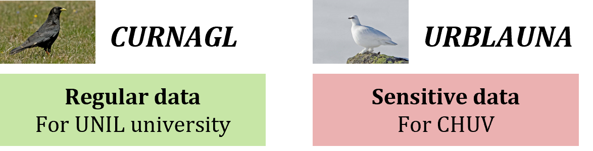

# CONNEXION TO UNIL STORAGE

## UNIL Storage Spaces

Two storage spaces are available on UNIL servers to store the project's data.

{width=30%}

*REGULAR DATA - CURNAGL*
UNIL HPC Cluster
For all the detailed information: [CURNAGL WIKI UNIL](https://wiki.unil.ch/ci/books/high-performance-computing-hpc/page/curnagl)

*SENSITIVE DATA - URBLAUNA* 
UNIL Sensitive data compute cluster
For all the detailed information: [URBLAUNA WIKI UNIL](https://wiki.unil.ch/ci/books/high-performance-computing-hpc/page/urblauna)

## CURNAGL & URBLAUNA Characteristics

{width=50%}

## Connexion to Storage Spaces

### Curnagl  
1. Open a terminal
2. Command Line:

	ssh username@curnagl.dcsr.unil.ch
3. Enter your UNIL password

### Urblauna 

#### via Command Line
1. Open a terminal
2. Command Line:

	ssh username@u-ssh.dcsr.unil.ch

3. Enter your UNIL password
4. Enter the verification code from your authenticator app

#### via Web Interface

## Access to UNIL storage space

- CURNAGL
	- Simple authentication with your UNIL username
- URBLAUNA
	- Double authentication
		- with your UNIL username
		- and confirmation via phone application (authenticator)

## Getting the access

Getting access to UNIL servers: [UNIL Wiki Page](https://wiki.unil.ch/ci/books/high-performance-computing-hpc/page/how-to-access-the-clusters) 

Getting UNIL access following this [procedure](https://wiki.unil.ch/ci/books/high-performance-computing-hpc/page/providing-access-to-external-collaborators)
1. If you don’t have one, create a [EduID profile](https://login.eduid.ch/idp/profile/SAML2/Redirect/SSO?execution=e1s2)
2. Fill the form for creation of UNIL account with Patric as a sponsor 
3. Link your UNIL account and EduID profiles on [id.unil.ch](https://id.unil.ch/)
4. Send your UNIL username to Patric
5. Activate UNIL VPN
6. Connect to the server

## Connexion to UNIL VPN

Download [Ivanti Secure Access Client](https://www.ivanti.com/products/secure-unified-client)  
Connect using your switch edu-ID account  
Confirm the identification on your phone using authenticator app.

## Tutos - Videos

How to connect to Curnagl:

