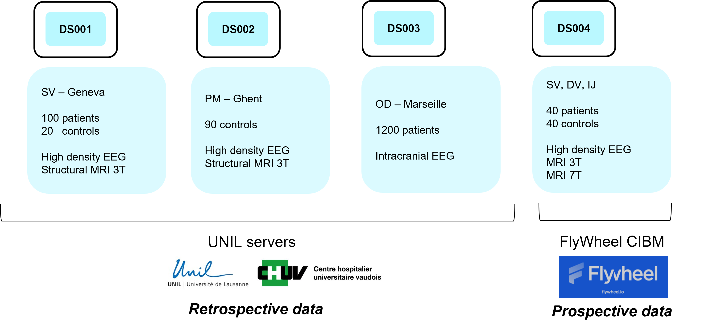



# Data Management Plan

## Data of the project

The project will use four different datasets.
Three are retrospective/historical datasets collected by the different project's institutions. 

{width=30%}

A distinct workpackage of the grant is fully committed to data management and the promotion of open science.  

## Organization on the server

All the datasets are fully anonymized and organized according to BIDS standards on the CHUV-UNIL server for storage and back-up.
(the different MRI images according to their different protocols and the EEG data)

Level of anonymization?
- Identification informations in all the file
- Where is the encryption key stored?
- Defacing?
- List of images which can be considered as no sensitive ou sensitive (for distinction Curnagl/Urblauna).

On the non sensitive server, data provenance and tracking of the different version/versioning 

FAIR -- include which steps make our datasets respect FAIR principles

## Data Release

Data release for publications will be released in BIDS format on Zenodo or open-neuro, in a BIDS-compliant format for compatibility with BIDS-app. 

Release on open-neuro:  

## Code Release

Codes and analyses pipeline -- Github Repositories  
For mor reproducibility: encapsulation of the pipeline into conda environments at minima or docker  
The docker allows to reproduce the exact pipeline without meeting the issues of package versions or different Operating System.  
Eventually all the pipelines and developed methods in a software framework.  
Connectomemapper3 was the software which was the outcome of the last sinergia project  
In the continuity, an update will be provided and eventually a remodeling of the software in a more modular organization.   

Methods Summary
- BIDS neuroimaging standard for MRI and EEG data
- Version control system using github for the code and datalad for the data
- Container (singularity and docker) for reproducible software encapsulation
- Open access code and data though platforms like zenodo.org and openneuro.org
- Data delivered in standard space using atlases

Outputs
- A super connectome: statistical average over our healthy subjects and provide all the quantitative directed connectivity information.
- All cohorts will be converted into the super connectome framework and openly released. 
