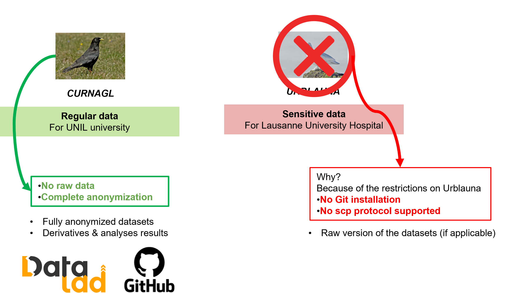
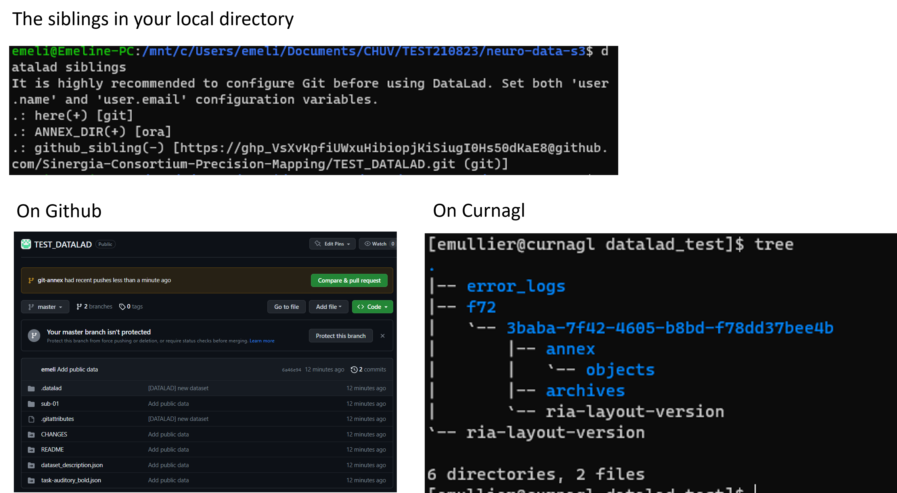




# DATALAD 


[Datalad](https://www.datalad.org/) is an open-source data management solution based on Git and Git-Annex.

Particularly, it can:
- Keep track of your data
- Create structure
- Ensure reproducibility
- Supports collaboration


## Install DataLad


## Basic commands with DataLad

All the possible commands and possibilities with DataLad are exhaustively explained in the [DataLad Handbook](https://handbook.datalad.org/en/latest/)


### Create a datalad dataset from your local dataset

1. Download  locally a small dataset from OpenNeuro

``` py
    # Create the directory
    mkdir neuro-data-s3

    # Download the data
    wget https://www.fil.ion.ucl.ac.uk/spm/download/data/MoAEpilot/MoAEpilot.bids.zip -O neuro-data-s3.zip

    # Unzip the data
    unzip neuro-data-s3.zip -d neuro-data-s3

    # Move the data
    rm neuro-data-s3.zip && cd neuro-data-s3 
    mv MoAEpilot/* . && rm -R MoAEpilot
```


2. Turn local dataset into a DataLad Dataset

In your local directory with your data:

``` py
    # Start datalad tracking on the dataset
    datalad create --force --description "Neurodata to host on Github and Curnagl"

    # Check the status of datalad
    datalad status

    # Save your first change, adding the data
    datalad save -m "Add public data"

    datalad status
```


## Make the full dataset available to the SINERGIA consortium


### Note on the infrastructure 

Because of the restricitions related to the storage of sensitive data imposed by UNIL, it is unfortunately no possible yet to implement DataLad on Urblauna.
However, DataLad should be used for data provenance and tracking of all the data stored on Curnagl. 

{width=45%}

### Create a sibling dataset on Curnagl

In your local directory (for example, in the neuro-s3-data directory from the previous section)

``` py
        # Show all the existing siblings
        datalad siblings

        # Create a RIA store to store all the annex from Git-Annex on Curnagl
        datalad create-sibling-ria -s ANNEX_DIR ria+ssh://emullier@curnagl.dcsr.unil.ch:/work/PRTNR/CHUV/RADMED/phagmann/sinergia2norm/datalad_test --storage-sibling only
```

You can check on Curnagl, the directory 'datalad_test' should have been created. 


### Create a sibling (without annex) on Github

In your local directory again:

``` py
    # Show all the existing siblings
    datalad siblings

    # Create the datalad sibling linked to the RIA store on Curnagl
    datalad create-sibling-github -d . TEST_DATALAD --publish-depends ANNEX_DIR -s github_sibling --credential your_github_token --github-organization sinergia-consortium-precision-mapping

    # Check if the datalad github sibling has been created
    datalad siblings

    # Push the data
    datalad push --to github_sibling
```


### A glance on the final configuration

You can check if all your siblings are correctly set and if the data are stored correctly on Github and Curnagl.

{width=50%}


