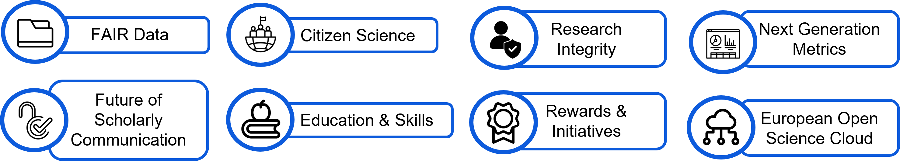

# Open Science Principles

Supported by the FNS Grant #XXXX, we are committed to follow basic open sciences principles and FAIR data. 

A lot of barriers exit for Open Science:

The 8 pillars of Open Science defined by the European Commission. 
{width=60%}

All the datasets released by the consortium must respect the FAIR principles:

